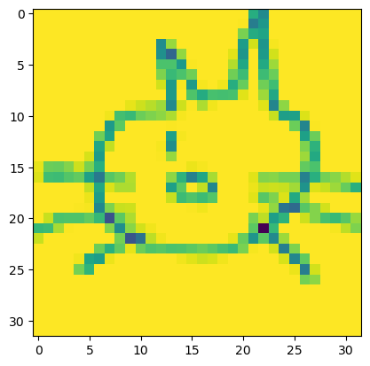
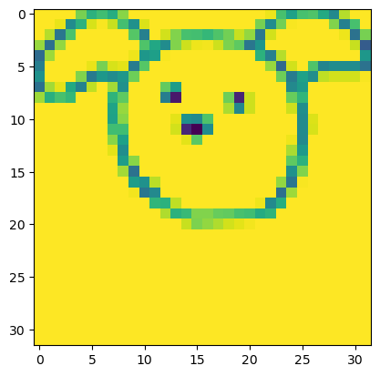
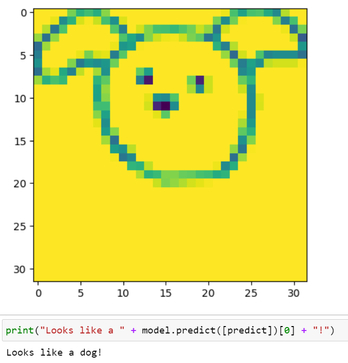

# Google Quickdraw

Google quickdraw is a dataset containing over 50 million labeled doodles of various objects. The ones in my project include cats, dogs, fish and dolphin doodles curated by some of the greatest artists known to man. Examples of some doodles include:

</img>
</img>

How can I tell what these drawings are depicting? Because contrary to what I said prior after taking a second look they're terrible! With the application of ```Linear Regression``` we determine what these images are depicting based on previously labeled drawings.

* Fetch the drawings from Google's ```QuickDraw``` library.
* Resize and grayscale the drawings.
* Train SciKitLearn's ```LinearRegression``` class on the pixel data.
* Predict labels of new drawings.

</img>

Doesn't look like any dog i've ever seen...
